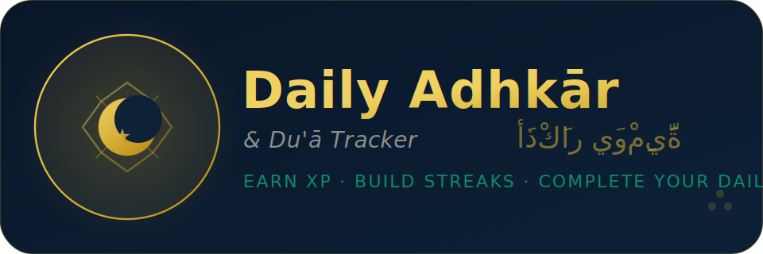

# Daily Adhkār & Du'ā Tracker — ذِكْرلي

A minimal, gamified daily tracker for Islamic adhkār and du'ā — built with Next.js 15, TypeScript, and Tailwind CSS v4.



---

## Features

- **14 duas & athkār** — full Arabic text, transliteration, and English meaning on every card
- **3-tab layout per card** — Arabic (default) · English · Transliteration
- **Daily checkbox tracker** — mark each dua complete with a satisfying check animation
- **Streak counter** — tracks consecutive days of full completion
- **7-day history chart** — visual bar chart of your weekly completion rate
- **Light & dark mode** — persisted to `localStorage`, no flash on load
- **Search & filter** — by category (Qur'ān / Athkār / Du'ā) or priority
- **Hijri + Gregorian date** — shown in the header
- **Fully responsive** — works on mobile, tablet, and desktop
- **Zero backend** — all data stored locally in the browser

---

## Tech Stack

| Layer | Library |
|---|---|
| Framework | Next.js 15 (App Router) |
| Language | TypeScript |
| Styling | Tailwind CSS v4 |
| Fonts | Crimson Pro · Scheherazade New (via `next/font/google`) |
| Storage | `localStorage` (no database) |

---

## Project Structure

```
dhikrly/
├── app/
│   ├── layout.tsx          # Root layout — fonts, metadata, favicon, dark-mode script
│   ├── page.tsx            # Entry point — renders <DuasTracker />
│   └── globals.css         # Tailwind v4 @import + @theme + base styles
├── components/
│   └── duas-tracker.tsx    # Main component — all UI logic
├── public/
│   ├── logo.svg            # Full lockup logo (SVG)
│   ├── logo.png            # Logo 960×320px
│   ├── logo@2x.png         # Logo 1440×480px (retina)
│   ├── favicon.svg         # Crescent + star favicon (SVG)
│   ├── favicon.ico         # Multi-size ICO (16/32/48px)
│   ├── favicon-16x16.png
│   ├── favicon-32x32.png
│   ├── favicon-48x48.png
│   ├── favicon-128x128.png
│   ├── favicon-180x180.png # Apple touch icon
│   ├── favicon-192x192.png # Android / PWA
│   └── favicon-512x512.png # PWA splash
├── postcss.config.mjs      # @tailwindcss/postcss plugin
├── tailwind.config.ts      # darkMode: "class" + content paths
├── tsconfig.json
└── package.json
```

---

## Getting Started

### Prerequisites

- Node.js 18+
- npm 9+

### Install & run

```bash
# Clone the repo
git clone https://github.com/nazrulislambhat/dhikrly.git
cd dhikrly

# Install dependencies
npm install

# Start the dev server
npm run dev
```

Open [http://localhost:3000](http://localhost:3000).

### Build for production

```bash
npm run build
npm start
```

---

## Deployment

The app is a standard Next.js project and deploys to Vercel with zero configuration.

```bash
# Install Vercel CLI
npm i -g vercel

# Deploy
vercel
```

Or connect your GitHub repo to [vercel.com](https://vercel.com) and it deploys automatically on every push.

---

## Tailwind v4 Notes

This project uses **Tailwind CSS v4**, which has a different setup from v3:

| | v3 | v4 (this project) |
|---|---|---|
| PostCSS plugin | `tailwindcss` | `@tailwindcss/postcss` |
| CSS entry point | `@tailwind base/components/utilities` | `@import "tailwindcss"` |
| Theme extensions | `tailwind.config.ts extend: {}` | `globals.css @theme {}` |
| Custom fonts | config `fontFamily` | `@theme { --font-display: ... }` |

Custom fonts and animations are declared in `globals.css` under `@theme`:

```css
@theme {
  --font-display: "Crimson Pro", Georgia, serif;
  --font-arabic:  "Scheherazade New", "Traditional Arabic", serif;
  --animate-fade-in: fade-in 0.25s ease forwards;
}
```

This auto-generates the `font-display`, `font-arabic`, and `animate-fade-in` utility classes.

---

## Dark Mode

Dark mode is class-based (`html.dark`). An inline script in `layout.tsx` reads `localStorage` before React hydrates, so there is never a flash of the wrong theme:

```ts
// layout.tsx 
(function () {
  var s = JSON.parse(localStorage.getItem('duas_settings_v3') || '{}');
  document.documentElement.classList.add(s.dark === false ? 'light' : 'dark');
})();
```

The root `<div>` in the component uses `suppressHydrationWarning` to prevent React from warning about the intentional server/client className difference.

---

## localStorage Keys

| Key | Contents |
|---|---|
| `duas_checked_v3` | `Record<dateString, Record<duaId, boolean>>` — 60 days of history |
| `duas_streak_v3` | `{ current, best, lastComplete }` |
| `duas_settings_v3` | `{ dark: boolean }` |

---

## Duas Included

| # | Title | Category | When |
|---|---|---|---|
| 1 | Ayat al-Kursi | Qur'ān | After every Fard Ṣalāh · Before sleep |
| 2 | Surah Al-Ikhlāṣ | Qur'ān | 3× morning & evening |
| 3 | Surah Al-Falaq | Qur'ān | 3× morning & evening |
| 4 | Surah An-Nās | Qur'ān | 3× morning & evening |
| 5 | Tasbīḥ of the Heart | Athkār | 3× every morning |
| 6 | Ḥasbiyallāh | Athkār | 7× morning · 7× evening |
| 7 | Du'ā for Beneficial Knowledge | Du'ā | 1× after Fajr |
| 8 | Du'ā of Yūnus | Du'ā | In hardship |
| 9 | Refuge from Worry & Debt | Du'ā | 1× morning & evening |
| 10 | Du'ā by the Greatest Name | Du'ā | 1× with full presence |
| 11 | Du'ā for Sufficiency Through Ḥalāl | Du'ā | 1× after Fajr |
| 12 | Du'ā for Glory & Provision | Du'ā | Seeking provision |
| 13 | Du'ā of Mūsā | Du'ā | In need |
| 14 | Du'ā for Good in Both Worlds | Du'ā | After every du'ā |

---

## License

MIT — free to use, modify, and distribute.

---

*May Allah accept it from all of us. آمين*